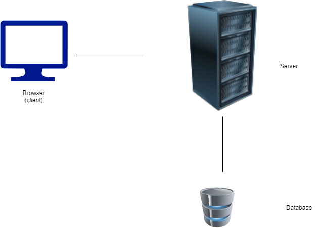

# Node.js Week 1 (Lesson Plan)

## Goal

* introduce students to the concept of server-side (backend) programing
* Node and npm basics (npm init, npm install, package.json, require)
* basic express server

## FIRST HALF (12.05 - 13.30)

**START RECORDING**

### 1. Q&A about last course's concepts

#### Explanation

* callbacks and event listeners

#### Example

```javascript
function sayHello(event) {
    console.log('Key pressed: '+String.fromCharCode(event.which));
}

document.body.addEventListener('keypress',sayHello);
```

Arrow notation:
```javascript
document.body.addEventListener('keypress',event => {
    console.log('Key pressed: '+String.fromCharCode(event.which));
});
```

Additional parameters:

```javascript
function sayHello(event,name) {
    console.log(name+ ' pressed '+String.fromCharCode(event.which));
}

let name = 'Andrej';
document.body.addEventListener('keypress',event => {
    sayHello(event, name);
});
```

#### Essence

* callbacks are used whenever asynchronous behavior is needed. We do not know when a button will be pressed or a fetch request will finish.

### 2. Backend and node basics?

#### Explain

All web sites have a server that hosts the main application logic and interacts with the database which has all data of an application. The browser is only there for user interaction. Backend applications typically do not have a graphical user interface.



Node.js is a server-side javascript platform. 
Ask students to name some other server-side technologies.
(don't go into details such as threads vs async). 

Why node? Because we already learned/know javascript.

#### Examples

`node --version`

Hello World example

#### Exercise

In a new javascript file write a function that returns true if a day is a weekend and false if it is not.

```javascript
function isWeekend(dayOfWeek) {
    if ( dayOfWeek === 'Saturday' ) 
       return true;
    if ( dayOfWeek === 'Monday' ) 
       return false;
    // fill in the rest
}


console.log('Tuesday is a '+(isWeekend('Tuesday')?'weekend': 'week day')); // week day
console.log('Friday is a '+(isWeekend('Friday')?'weekend': 'week day')); // week day
console.log('Sunday is a '+(isWeekend('Sunday')?'weekend': 'week day')); // weekend
```

Execute the file with node.

#### Essence

* basic server architecture
* Running scripts from node.js

### 3. Client-server model

#### Explain

* Request and response (use server architecture diagram)
* HTTP, URL, port, content type (method, status etc is for week 2)

#### Example

follow the requests and responses in chrome under the network tab - https://fullstack-exampleapp.herokuapp.com/

#### Exercise

Ask different students to identify the following in this screenshot:


* URL:  
* PORT:  
* IP address:
* Content-Type:

#### Essence

Request response play

## SECOND HALF (14.00 - 16.00)

### 4. Node package manager

#### Explain

* Why? 
  - write code in multiple files
  - easily reuse code from others in a managed way.

Where is npm? How to search for modules?

#### Example

Explain `require` with a local file (see code-with-students)

Explain  `npm init --yes` show package json (see code-with-students)

Explain `npm install` 

#### Exercise

Ask students to setup npm project in empty package and install `one-liner-joke`. Then add the missing statement to the bellow javascript to make it run and print a joke to the console.

```javascript
// what is missing here?

console.log(oneLinerJoke.getRandomJoke().body);
```

#### Essence

* npm, init/install/package

### 5. Express.js

#### Explain

What is Express.js. Why? because it is the most popular module for writing servers in Node.
(mention that there are other modules notably `http` but don't go into specifics)

#### Example (code along)

Show them a running app express app.

Use browser network tab to show request response:

https://obscure-anchorage-82962.herokuapp.com/

In a new folder:
```shell
> npm init
> npm install express
```

Create a javascript file `server.js` with the following code:

```javascript
const express = require('express')
const app = express()
const port = 3000

app.get('/', (req, res) => res.send('Hello World!'))

app.listen(port, () => console.log(`Example app listening on port ${port}!`))
```

Start the app using `node server.js`. Check if the app is running by opening the following URL in the browser `localhost:3000`

#### Exercise 

Write an express app that server the following HTML:

```html
<html>
    <head>
        <title>Task app</title>
    </head>
    <body>
        <h1>Things to do</h1>
        <ul>
            <li>Write homework</li>
            <li>Buy groceries</li>
            <li>Prepare dinner</li>
            <li>Watch movie</li>
        </ul>
    </body>
</html>
```

Extra: add an external css to the app that makes the list items alternating colors.

#### Essence

* How to install and run a basic express file


